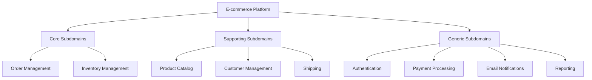

# 🔹 Phase 2: From Problem Statement to DDD Model

## Overview
This guide demonstrates how to transform business requirements into a well-structured DDD model. You'll learn to identify subdomains, define bounded contexts, and design aggregates systematically.

---

## 📋 Table of Contents
1. [The DDD Modeling Process](#modeling-process)
2. [Step-by-Step Example: E-commerce Platform](#example-walkthrough)
3. [Advanced Modeling Techniques](#advanced-techniques)
4. [Common Modeling Mistakes](#common-mistakes)
5. [Tools and Techniques](#tools-techniques)

---

## 🎯 The DDD Modeling Process

### 1. Requirements Analysis
Start with understanding the business domain and stakeholder needs.

### 2. Domain Exploration
Conduct Event Storming or Domain Storytelling sessions.

### 3. Subdomain Identification
Break down the problem space into manageable pieces.

### 4. Bounded Context Definition
Create clear boundaries for each model.

### 5. Aggregate Design
Identify consistency boundaries and transactional units.

### 6. Context Mapping
Define relationships between bounded contexts.

---

## 🛍️ Step-by-Step Example: E-commerce Platform

### 📌 Problem Statement
> *"Build an e-commerce platform where users can browse products, place orders, manage inventory, process payments, handle shipping, and provide customer support."*

Let's model this systematically.

---

### Step 1: Discover Subdomains

**Technique**: Ask "What are the key business capabilities?"

#### Core Subdomains (Competitive Advantage)
- **Order Management**: Core business logic for processing orders
- **Inventory Management**: Stock tracking and availability

#### Supporting Subdomains (Important but not differentiating)
- **Product Catalog**: Product information and browsing
- **Customer Management**: User profiles and preferences
- **Shipping**: Delivery coordination

#### Generic Subdomains (Common across industries)
- **Authentication & Authorization**: User identity
- **Payment Processing**: Credit card processing
- **Email Notifications**: Communication
- **Reporting**: Analytics and dashboards



**Key Insight**: Focus most of your DDD effort on Core subdomains.

---

### Step 2: Define Bounded Contexts

**Technique**: Look for different business rules, vocabularies, and team boundaries.

#### Analysis Results:

| Subdomain | Bounded Context | Rationale |
|-----------|----------------|-----------|
| Order Management | `OrderContext` | Complex business rules, order lifecycle |
| Inventory Management | `InventoryContext` | Different view of products (stock vs catalog) |
| Product Catalog | `CatalogContext` | Read-optimized product information |
| Customer Management | `CustomerContext` | Customer lifecycle and preferences |
| Shipping | `ShippingContext` | Logistics and delivery tracking |
| Authentication | `IdentityContext` | User identity and access |
| Payment | `PaymentContext` | Financial transactions |
| Notifications | `NotificationContext` | Communication management |

**Context Relationships**:
```
[OrderContext] ──uses──> [CustomerContext]
[OrderContext] ──reserves──> [InventoryContext]
[OrderContext] ──charges──> [PaymentContext]
[OrderContext] ──ships via──> [ShippingContext]
[ShippingContext] ──notifies via──> [NotificationContext]
```

---

### Step 3: Identify Aggregates per Context

Let's focus on the core contexts:

#### OrderContext Aggregates

**Order Aggregate**:
```javascript
class Order {  // Aggregate Root
  constructor(orderId, customerId) {
    this.orderId = orderId;        // Identity
    this.customerId = customerId;
    this.status = 'PENDING';
    this.orderDate = new Date();
    this.lineItems = [];           // Internal entities
    this.shippingAddress = null;   // Value object
    this.billingAddress = null;    // Value object
    this.totalAmount = new Money(0, 'USD'); // Value object
  }

  addLineItem(productId, quantity, unitPrice) {
    // Business rule: Cannot add items to shipped orders
    if (this.status === 'SHIPPED') {
      throw new Error('Cannot modify shipped orders');
    }

    const lineItem = new OrderLineItem(productId, quantity, unitPrice);
    this.lineItems.push(lineItem);
    this.recalculateTotal();
  }

  confirm() {
    // Business rule: Cannot confirm empty orders
    if (this.lineItems.length === 0) {
      throw new Error('Cannot confirm empty order');
    }
    
    this.status = 'CONFIRMED';
    
    // Raise domain event
    this.addDomainEvent(new OrderConfirmed(this.orderId, this.customerId));
  }

  ship(trackingNumber) {
    if (this.status !== 'CONFIRMED') {
      throw new Error('Only confirmed orders can be shipped');
    }
    
    this.status = 'SHIPPED';
    this.trackingNumber = trackingNumber;
    
    this.addDomainEvent(new OrderShipped(this.orderId, trackingNumber));
  }
}

class OrderLineItem {  // Entity within aggregate
  constructor(productId, quantity, unitPrice) {
    this.lineItemId = generateId();
    this.productId = productId;
    this.quantity = quantity;
    this.unitPrice = unitPrice;
  }

  getSubtotal() {
    return this.quantity * this.unitPrice;
  }
}
```

#### InventoryContext Aggregates

**ProductStock Aggregate**:
```javascript
class ProductStock {  // Aggregate Root
  constructor(productId, initialQuantity) {
    this.productId = productId;
    this.availableQuantity = initialQuantity;
    this.reservedQuantity = 0;
    this.reorderLevel = 10;
    this.reservations = [];
  }

  reserve(quantity, orderId) {
    if (this.availableQuantity < quantity) {
      throw new Error('Insufficient stock');
    }

    const reservation = new StockReservation(orderId, quantity);
    this.reservations.push(reservation);
    this.availableQuantity -= quantity;
    this.reservedQuantity += quantity;

    // Business rule: Alert when below reorder level
    if (this.availableQuantity <= this.reorderLevel) {
      this.addDomainEvent(new StockLevelLow(this.productId, this.availableQuantity));
    }

    this.addDomainEvent(new StockReserved(this.productId, quantity, orderId));
  }

  confirmReservation(orderId) {
    const reservation = this.reservations.find(r => r.orderId === orderId);
    if (!reservation) {
      throw new Error('Reservation not found');
    }

    this.reservedQuantity -= reservation.quantity;
    this.reservations = this.reservations.filter(r => r.orderId !== orderId);
    
    this.addDomainEvent(new StockDeducted(this.productId, reservation.quantity));
  }

  releaseReservation(orderId) {
    const reservation = this.reservations.find(r => r.orderId === orderId);
    if (!reservation) {
      throw new Error('Reservation not found');
    }

    this.availableQuantity += reservation.quantity;
    this.reservedQuantity -= reservation.quantity;
    this.reservations = this.reservations.filter(r => r.orderId !== orderId);
    
    this.addDomainEvent(new StockReleased(this.productId, reservation.quantity));
  }
}

class StockReservation {  // Value Object
  constructor(orderId, quantity, expiresAt = null) {
    this.orderId = orderId;
    this.quantity = quantity;
    this.reservedAt = new Date();
    this.expiresAt = expiresAt || new Date(Date.now() + 30 * 60 * 1000); // 30 min
    Object.freeze(this);
  }

  isExpired() {
    return new Date() > this.expiresAt;
  }
}
```

#### CatalogContext Aggregates

**Product Aggregate**:
```javascript
class Product {  // Aggregate Root
  constructor(productId, name, description, category) {
    this.productId = productId;
    this.name = name;
    this.description = description;
    this.category = category;
    this.price = null;
    this.images = [];
    this.attributes = new Map();
    this.isActive = true;
  }

  updatePrice(newPrice) {
    const oldPrice = this.price;
    this.price = newPrice;
    
    if (oldPrice && !oldPrice.equals(newPrice)) {
      this.addDomainEvent(new ProductPriceChanged(this.productId, oldPrice, newPrice));
    }
  }

  addImage(imageUrl, altText) {
    const image = new ProductImage(imageUrl, altText);
    this.images.push(image);
  }

  setAttribute(name, value) {
    this.attributes.set(name, value);
  }
}

class Money {  // Value Object
  constructor(amount, currency) {
    if (amount < 0) throw new Error('Amount cannot be negative');
    this.amount = amount;
    this.currency = currency;
    Object.freeze(this);
  }

  equals(other) {
    return this.amount === other.amount && this.currency === other.currency;
  }

  add(other) {
    if (this.currency !== other.currency) {
      throw new Error('Cannot add different currencies');
    }
    return new Money(this.amount + other.amount, this.currency);
  }
}
```

---

### Step 4: Define Ubiquitous Language

Create a glossary that both technical and business teams understand:

#### Order Management Context
- **Place Order**: Customer submits order for products
- **Confirm Order**: Verify payment and inventory, commit to fulfillment
- **Ship Order**: Dispatch products to customer
- **Cancel Order**: Stop order processing and release resources
- **Line Item**: Individual product and quantity within an order

#### Inventory Context
- **Reserve Stock**: Hold inventory for pending order
- **Confirm Reservation**: Finalize stock allocation for confirmed order
- **Release Reservation**: Return held stock to available pool
- **Reorder Level**: Minimum stock threshold triggering replenishment
- **Stock Out**: No available inventory for a product

#### Catalog Context
- **Product**: Item available for sale
- **Category**: Grouping of related products
- **Active Product**: Product available for customer browsing
- **Product Variant**: Different options of the same base product

---

### Step 5: Model Domain Events

Events represent important business occurrences:

```javascript
// Order Context Events
class OrderPlaced extends DomainEvent {
  constructor(orderId, customerId, lineItems) {
    super();
    this.orderId = orderId;
    this.customerId = customerId;
    this.lineItems = lineItems;
  }
}

class OrderConfirmed extends DomainEvent {
  constructor(orderId, customerId) {
    super();
    this.orderId = orderId;
    this.customerId = customerId;
  }
}

class OrderShipped extends DomainEvent {
  constructor(orderId, trackingNumber) {
    super();
    this.orderId = orderId;
    this.trackingNumber = trackingNumber;
  }
}

// Inventory Context Events
class StockReserved extends DomainEvent {
  constructor(productId, quantity, orderId) {
    super();
    this.productId = productId;
    this.quantity = quantity;
    this.orderId = orderId;
  }
}

class StockLevelLow extends DomainEvent {
  constructor(productId, currentLevel) {
    super();
    this.productId = productId;
    this.currentLevel = currentLevel;
  }
}
```

---

### Step 6: Context Integration

Define how contexts communicate:

```javascript
// Event Handlers for cross-context integration
class OrderEventHandler {
  constructor(inventoryService, paymentService, shippingService) {
    this.inventoryService = inventoryService;
    this.paymentService = paymentService;
    this.shippingService = shippingService;
  }

  async handleOrderPlaced(event) {
    // Reserve inventory for each line item
    for (const lineItem of event.lineItems) {
      await this.inventoryService.reserveStock(
        lineItem.productId,
        lineItem.quantity,
        event.orderId
      );
    }
  }

  async handleOrderConfirmed(event) {
    // Confirm inventory reservations
    await this.inventoryService.confirmReservations(event.orderId);
    
    // Process payment
    await this.paymentService.capturePayment(event.orderId);
  }

  async handleOrderShipped(event) {
    // Update shipping status
    await this.shippingService.markAsShipped(event.orderId, event.trackingNumber);
  }
}
```

---

## 🎯 Advanced Modeling Techniques

### Event Storming
Collaborative workshop to discover domain events and workflows.

**Steps**:
1. Gather domain experts and developers
2. Generate domain events (orange sticky notes)
3. Order events in timeline
4. Add commands (blue) and actors (yellow)
5. Identify aggregates and bounded contexts

### Domain Storytelling
Visual technique using pictographs to model domain workflows.

### Example Storming Session Results:
```
1. Customer places order → OrderPlaced
2. System reserves inventory → StockReserved
3. Payment is processed → PaymentCaptured
4. Order is confirmed → OrderConfirmed
5. Warehouse ships order → OrderShipped
6. Customer receives order → OrderDelivered
```

---

## 🚫 Common Modeling Mistakes

### ❌ Anemic Domain Model
```javascript
// Bad: No business logic in domain objects
class Order {
  constructor() {
    this.id = null;
    this.customerId = null;
    this.items = [];
    this.status = null;
  }
  
  // Only getters/setters, no behavior
}

class OrderService {
  processOrder(order) {
    // All business logic in service
    if (order.items.length === 0) {
      throw new Error('Empty order');
    }
    order.status = 'CONFIRMED';
  }
}
```

```javascript
// Good: Rich domain model
class Order {
  confirm() {
    if (this.lineItems.length === 0) {
      throw new Error('Cannot confirm empty order');
    }
    
    this.status = 'CONFIRMED';
    this.addDomainEvent(new OrderConfirmed(this.orderId));
  }
}
```

### ❌ God Aggregates
```javascript
// Bad: Everything in one aggregate
class CustomerAggregate {
  constructor() {
    this.profile = {};
    this.orders = [];      // Should be separate aggregate
    this.payments = [];    // Should be separate aggregate
    this.addresses = [];
    this.preferences = {};
  }
}
```

### ❌ CRUD-Based Contexts
```javascript
// Bad: Technical boundaries
contexts = [
  'UserCRUD',
  'ProductCRUD', 
  'OrderCRUD'
]

// Good: Business boundaries
contexts = [
  'CustomerManagement',
  'ProductCatalog',
  'OrderProcessing'
]
```

---

## 🛠️ Tools and Techniques

### Modeling Tools
- **EventStorming**: Miro/Mural boards
- **Context Mapping**: Draw.io, Lucidchart
- **Code**: IDE with refactoring support

### Documentation
- **ADRs**: Architecture Decision Records
- **Context Maps**: Visual representations
- **Glossaries**: Living documents

### Validation Techniques
- **Walking Skeletons**: End-to-end minimal implementation
- **Ubiquitous Language Reviews**: Regular terminology sessions
- **Domain Expert Pairing**: Code with business stakeholders

---

## ✅ Modeling Checklist

- [ ] Business problem clearly understood
- [ ] Subdomains identified (Core/Supporting/Generic)
- [ ] Bounded contexts defined with clear boundaries
- [ ] Aggregates designed around consistency needs
- [ ] Ubiquitous language documented and shared
- [ ] Domain events identified
- [ ] Context relationships mapped
- [ ] Integration patterns chosen
- [ ] Model validated with domain experts

---

## 🎯 Next Steps
With your domain model in place, proceed to **Phase 3: Monolith Decomposition** to learn how to extract these bounded contexts from existing monolithic applications.