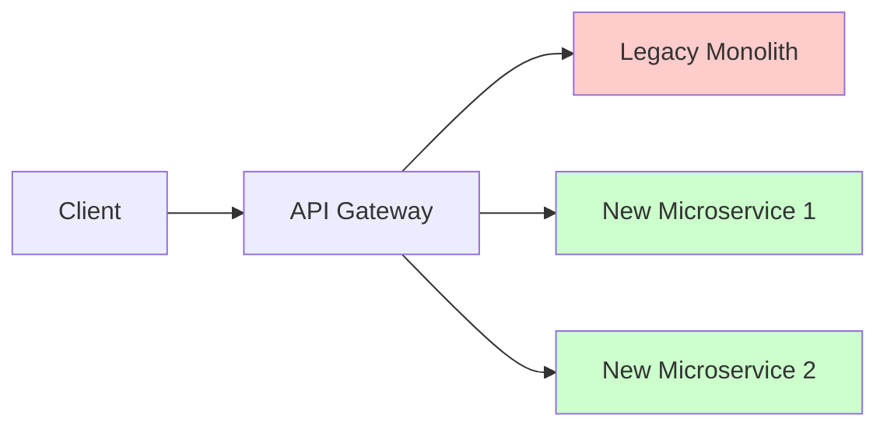

# 🔹 Phase 3: Monolith → Microservices via DDD

## Overview
This guide demonstrates how to systematically decompose a monolithic application into microservices using Domain-Driven Design principles. We'll focus on practical strategies, data migration patterns, and maintaining system integrity during the transition.

---

## 📋 Table of Contents
1. [Assessment and Planning](#assessment-planning)
2. [Decomposition Strategy](#decomposition-strategy)
3. [Data Migration Patterns](#data-migration)
4. [Service Extraction Techniques](#service-extraction)
5. [Case Study: E-commerce Monolith](#case-study)
6. [Migration Checklist](#migration-checklist)

---

## 📊 Assessment and Planning

### Pre-Migration Analysis

Before starting decomposition, understand your current system:

#### 1. Code Analysis
```bash
# Analyze coupling and dependencies
npm install -g dependency-cruiser
dependency-cruise --output-type dot src/ | dot -T svg > dependencies.svg

# Find highly coupled modules
cloc --by-file src/ | sort -k4 -nr
```

#### 2. Database Analysis
```sql
-- Find table relationships
SELECT 
    tc.constraint_name,
    tc.table_name,
    kcu.column_name,
    ccu.table_name AS foreign_table_name,
    ccu.column_name AS foreign_column_name
FROM information_schema.table_constraints AS tc
JOIN information_schema.key_column_usage AS kcu
    ON tc.constraint_name = kcu.constraint_name
JOIN information_schema.constraint_column_usage AS ccu
    ON ccu.constraint_name = tc.constraint_name
WHERE tc.constraint_type = 'FOREIGN KEY';
```

#### 3. Business Logic Mapping
Map business capabilities to code modules:

```javascript
// Example: Identify business capabilities in monolith
const businessCapabilities = {
  userManagement: {
    controllers: ['UserController', 'AuthController'],
    services: ['UserService', 'AuthenticationService'],
    models: ['User', 'Role', 'Permission'],
    routes: ['/api/users/*', '/api/auth/*']
  },
  productCatalog: {
    controllers: ['ProductController', 'CategoryController'],
    services: ['ProductService', 'SearchService'],
    models: ['Product', 'Category', 'ProductImage'],
    routes: ['/api/products/*', '/api/categories/*']
  },
  orderManagement: {
    controllers: ['OrderController', 'CartController'],
    services: ['OrderService', 'PaymentService'],
    models: ['Order', 'OrderItem', 'Payment'],
    routes: ['/api/orders/*', '/api/cart/*']
  }
};
```

---

## 🎯 Decomposition Strategy

### The Strangler Fig Pattern

Gradually replace monolith functionality without stopping the system:



### Phase 1: Identify Bounded Contexts

**Example: E-commerce Monolith Analysis**

```javascript
// Current monolith structure
/src
  /controllers
    UserController.js       // User registration, profile
    ProductController.js    // Product CRUD, search
    OrderController.js      // Order creation, tracking
    PaymentController.js    // Payment processing
    CartController.js       // Shopping cart management
  /models
    User.js                 // User data and authentication
    Product.js              // Product information
    Order.js                // Order and order items
    Payment.js              // Payment transactions
    Cart.js                 // Shopping cart
  /services
    EmailService.js         // Notifications
    InventoryService.js     // Stock management
```

**Identified Bounded Contexts**:

1. **Identity Context**: User authentication and profile management
2. **Catalog Context**: Product information and search
3. **Shopping Context**: Cart and wishlist management  
4. **Order Context**: Order processing and fulfillment
5. **Payment Context**: Financial transactions
6. **Inventory Context**: Stock and warehouse management
7. **Notification Context**: Email and messaging

### Phase 2: Extract Services by Business Value

Start with **leaf contexts** (minimal dependencies):

```javascript
// Extraction Priority Order
const extractionPlan = [
  {
    service: 'notification-service',
    context: 'Notification Context',
    priority: 1,  // Low dependencies
    complexity: 'Low',
    businessValue: 'Medium'
  },
  {
    service: 'catalog-service', 
    context: 'Catalog Context',
    priority: 2,  // Read-heavy, cacheable
    complexity: 'Medium',
    businessValue: 'High'
  },
  {
    service: 'inventory-service',
    context: 'Inventory Context', 
    priority: 3,  // Bounded data model
    complexity: 'Medium',
    businessValue: 'High'
  },
  {
    service: 'order-service',
    context: 'Order Context',
    priority: 4,  // Core business logic
    complexity: 'High',
    businessValue: 'Very High'
  }
];
```

---

## 🗄️ Data Migration Patterns

### Pattern 1: Database per Service

**Before (Shared Database)**:
```sql
-- Single database with all tables
CREATE TABLE users (id, email, password_hash, created_at);
CREATE TABLE products (id, name, price, inventory_count);
CREATE TABLE orders (id, user_id, total_amount, status);
CREATE TABLE order_items (id, order_id, product_id, quantity);
```

**After (Service Databases)**:
```sql
-- identity-service database
CREATE TABLE users (id, email, password_hash, profile_data);

-- catalog-service database  
CREATE TABLE products (id, name, description, price, category_id);

-- inventory-service database
CREATE TABLE product_stock (product_id, available_quantity, reserved_quantity);

-- order-service database
CREATE TABLE orders (id, customer_id, status, total_amount);
CREATE TABLE order_items (id, order_id, product_sku, quantity, unit_price);
```

### Pattern 2: Data Synchronization Strategies

#### Event-Driven Synchronization
```javascript
// Product service publishes events
class ProductService {
  async createProduct(productData) {
    const product = new Product(productData);
    await this.repository.save(product);
    
    // Publish event for other services
    await this.eventBus.publish('ProductCreated', {
      productId: product.id,
      sku: product.sku,
      name: product.name,
      price: product.price
    });
  }
}

// Inventory service subscribes to product events
class InventoryEventHandler {
  async handleProductCreated(event) {
    const stockRecord = new ProductStock({
      productId: event.productId,
      sku: event.sku,
      availableQuantity: 0,
      reservedQuantity: 0
    });
    
    await this.stockRepository.save(stockRecord);
  }
}
```

#### Saga Pattern for Data Consistency
```javascript
class OrderCreationSaga {
  async execute(createOrderCommand) {
    const sagaId = generateId();
    
    try {
      // Step 1: Reserve inventory
      const reservation = await this.inventoryService.reserveStock({
        items: createOrderCommand.items,
        sagaId
      });
      
      // Step 2: Process payment
      const payment = await this.paymentService.authorizePayment({
        amount: createOrderCommand.totalAmount,
        customerId: createOrderCommand.customerId,
        sagaId
      });
      
      // Step 3: Create order
      const order = await this.orderService.createOrder({
        ...createOrderCommand,
        reservationId: reservation.id,
        paymentId: payment.id,
        sagaId
      });
      
      // Step 4: Confirm reservations
      await this.inventoryService.confirmReservation(reservation.id);
      await this.paymentService.capturePayment(payment.id);
      
      return order;
      
    } catch (error) {
      // Compensating actions
      await this.compensate(sagaId, error);
      throw error;
    }
  }
  
  async compensate(sagaId, error) {
    // Rollback in reverse order
    const sagaLog = await this.getSagaLog(sagaId);
    
    for (const step of sagaLog.reverse()) {
      switch (step.action) {
        case 'PAYMENT_AUTHORIZED':
          await this.paymentService.cancelPayment(step.paymentId);
          break;
        case 'STOCK_RESERVED':
          await this.inventoryService.releaseReservation(step.reservationId);
          break;
      }
    }
  }
}
```

### Pattern 3: Breaking Foreign Key Dependencies

**Problem**: Cross-service foreign key constraints
```sql
-- ❌ This won't work across services
CREATE TABLE orders (
    id UUID PRIMARY KEY,
    user_id UUID REFERENCES users(id),    -- User in different service
    product_id UUID REFERENCES products(id) -- Product in different service
);
```

**Solution**: Use IDs without constraints + eventual consistency
```sql
-- ✅ Service-local identifiers
CREATE TABLE orders (
    id UUID PRIMARY KEY,
    customer_id UUID,  -- Reference to identity service
    status VARCHAR(20),
    created_at TIMESTAMP
);

CREATE TABLE order_items (
    id UUID PRIMARY KEY,
    order_id UUID REFERENCES orders(id),
    product_sku VARCHAR(50),  -- Business identifier, not FK
    quantity INTEGER,
    unit_price DECIMAL(10,2)
);
```

```javascript
// Validate references via service calls
class OrderService {
  async createOrder(orderData) {
    // Validate customer exists
    const customer = await this.identityService.getCustomer(orderData.customerId);
    if (!customer) {
      throw new Error('Customer not found');
    }
    
    // Validate products exist and are available
    for (const item of orderData.items) {
      const product = await this.catalogService.getProduct(item.productSku);
      if (!product) {
        throw new Error(`Product ${item.productSku} not found`);
      }
      
      const availability = await this.inventoryService.checkAvailability(
        item.productSku, 
        item.quantity
      );
      if (!availability.available) {
        throw new Error(`Insufficient stock for ${item.productSku}`);
      }
    }
    
    // Create order with validated data
    const order = new Order(orderData);
    return await this.repository.save(order);
  }
}
```

---

## 🔧 Service Extraction Techniques

### Technique 1: Branch by Abstraction

Extract functionality behind interfaces before splitting services:

```javascript
// Step 1: Create abstraction
interface InventoryService {
  checkAvailability(productId: string, quantity: number): Promise<boolean>;
  reserveStock(productId: string, quantity: number, orderId: string): Promise<string>;
  releaseReservation(reservationId: string): Promise<void>;
}

// Step 2: Implement with existing monolith code
class MonolithInventoryService implements InventoryService {
  async checkAvailability(productId, quantity) {
    // Call existing monolith inventory logic
    return await this.legacyInventoryModule.isAvailable(productId, quantity);
  }
  
  async reserveStock(productId, quantity, orderId) {
    return await this.legacyInventoryModule.reserve(productId, quantity, orderId);
  }
}

// Step 3: Replace with microservice implementation
class RemoteInventoryService implements InventoryService {
  constructor(httpClient, baseUrl) {
    this.client = httpClient;
    this.baseUrl = baseUrl;
  }
  
  async checkAvailability(productId, quantity) {
    const response = await this.client.get(
      `${this.baseUrl}/products/${productId}/availability?quantity=${quantity}`
    );
    return response.data.available;
  }
  
  async reserveStock(productId, quantity, orderId) {
    const response = await this.client.post(
      `${this.baseUrl}/reservations`,
      { productId, quantity, orderId }
    );
    return response.data.reservationId;
  }
}
```

### Technique 2: Database Migration Strategy

#### Phase 1: Replicate Data
```javascript
// Dual write to both old and new databases
class ProductService {
  async createProduct(productData) {
    // Write to monolith database
    const legacyProduct = await this.legacyRepo.save(productData);
    
    // Also write to new service database
    try {
      await this.newProductService.createProduct(productData);
    } catch (error) {
      // Log but don't fail - new service is not critical yet
      console.error('Failed to sync to new product service:', error);
    }
    
    return legacyProduct;
  }
}
```

#### Phase 2: Verify Data Consistency
```javascript
// Data consistency checker
class DataConsistencyChecker {
  async verifyProducts() {
    const legacyProducts = await this.legacyRepo.findAll();
    const newProducts = await this.newProductService.getAllProducts();
    
    const discrepancies = [];
    
    for (const legacy of legacyProducts) {
      const newProduct = newProducts.find(p => p.id === legacy.id);
      
      if (!newProduct) {
        discrepancies.push({ type: 'MISSING', productId: legacy.id });
      } else if (!this.areEqual(legacy, newProduct)) {
        discrepancies.push({ 
          type: 'MISMATCH', 
          productId: legacy.id,
          legacy: legacy,
          new: newProduct
        });
      }
    }
    
    return discrepancies;
  }
}
```

#### Phase 3: Switch Reads
```javascript
// Gradually switch reads to new service
class ProductService {
  async getProduct(productId) {
    // Use feature flag to control traffic
    if (this.featureFlags.isEnabled('READ_FROM_NEW_SERVICE', productId)) {
      try {
        return await this.newProductService.getProduct(productId);
      } catch (error) {
        // Fallback to legacy on error
        console.error('New service failed, falling back:', error);
        return await this.legacyRepo.findById(productId);
      }
    }
    
    return await this.legacyRepo.findById(productId);
  }
}
```

#### Phase 4: Switch Writes
```javascript
// Finally switch writes to new service
class ProductService {
  async createProduct(productData) {
    if (this.featureFlags.isEnabled('WRITE_TO_NEW_SERVICE')) {
      const result = await this.newProductService.createProduct(productData);
      
      // Keep legacy in sync for safety
      try {
        await this.legacyRepo.save(productData);
      } catch (error) {
        console.error('Failed to sync to legacy:', error);
      }
      
      return result;
    }
    
    return await this.legacyRepo.save(productData);
  }
}
```

---

## 🛍️ Case Study: E-commerce Monolith

### Original Monolith Structure
```javascript
// Typical monolith architecture
const monolith = {
  controllers: [
    'UserController',      // Authentication, profile
    'ProductController',   // Product CRUD, search  
    'OrderController',     // Order creation, tracking
    'CartController',      // Shopping cart
    'PaymentController'    // Payment processing
  ],
  
  sharedDatabase: {
    tables: ['users', 'products', 'orders', 'order_items', 'payments', 'cart_items'],
    foreignKeys: [
      'orders.user_id -> users.id',
      'order_items.order_id -> orders.id', 
      'order_items.product_id -> products.id',
      'payments.order_id -> orders.id',
      'cart_items.user_id -> users.id',
      'cart_items.product_id -> products.id'
    ]
  },
  
  problems: [
    'Single deployment unit',
    'Tight coupling between modules',
    'Shared database creates bottleneck',
    'Difficult to scale specific features',
    'Technology lock-in'
  ]
};
```

### Decomposed Microservices Architecture

```javascript
const microservicesArchitecture = {
  services: [
    {
      name: 'identity-service',
      responsibility: 'User authentication and profile management',
      database: 'postgres-identity',
      tables: ['users', 'roles', 'sessions'],
      apis: ['/auth', '/users', '/profiles']
    },
    
    {
      name: 'catalog-service', 
      responsibility: 'Product information and search',
      database: 'postgres-catalog',
      tables: ['products', 'categories', 'product_images'],
      apis: ['/products', '/categories', '/search']
    },
    
    {
      name: 'inventory-service',
      responsibility: 'Stock management and reservations',
      database: 'postgres-inventory', 
      tables: ['product_stock', 'reservations', 'stock_movements'],
      apis: ['/stock', '/reservations']
    },
    
    {
      name: 'order-service',
      responsibility: 'Order processing and management',
      database: 'postgres-orders',
      tables: ['orders', 'order_items', 'order_events'],
      apis: ['/orders', '/order-tracking']
    },
    
    {
      name: 'payment-service',
      responsibility: 'Payment processing and transactions',
      database: 'postgres-payments',
      tables: ['payments', 'payment_methods', 'transactions'],
      apis: ['/payments', '/billing']
    }
  ],
  
  communication: {
    synchronous: ['REST APIs', 'GraphQL Federation'],
    asynchronous: ['Event Bus (RabbitMQ/Kafka)', 'Domain Events'],
    patterns: ['Saga', 'CQRS', 'Event Sourcing']
  },
  
  benefits: [
    'Independent deployment and scaling',
    'Technology diversity',
    'Team autonomy', 
    'Fault isolation',
    'Better performance optimization'
  ]
};
```

### Migration Timeline

**Week 1-2: Assessment and Planning**
- [ ] Analyze existing codebase and dependencies
- [ ] Identify bounded contexts
- [ ] Create migration roadmap
- [ ] Set up monitoring and observability

**Week 3-4: Extract Notification Service**
- [ ] Create notification-service infrastructure
- [ ] Migrate email/SMS functionality
- [ ] Update monolith to use new service
- [ ] Monitor and validate

**Week 5-6: Extract Catalog Service**
- [ ] Create catalog-service with product data
- [ ] Implement dual-write pattern
- [ ] Switch reads to new service gradually
- [ ] Validate data consistency

**Week 7-8: Extract Inventory Service**
- [ ] Create inventory-service
- [ ] Migrate stock management logic
- [ ] Implement stock reservation API
- [ ] Update order flow to use new service

**Week 9-12: Extract Order Service**
- [ ] Create order-service infrastructure
- [ ] Implement saga pattern for order processing
- [ ] Migrate order history and tracking
- [ ] Remove order logic from monolith

---

## ✅ Migration Checklist

### Pre-Migration
- [ ] Business stakeholders aligned on migration goals
- [ ] Bounded contexts clearly identified
- [ ] Migration strategy documented
- [ ] Rollback plan prepared
- [ ] Monitoring and alerting in place

### During Migration
- [ ] Feature flags enabled for gradual rollout
- [ ] Data consistency verified at each step
- [ ] Performance monitoring active
- [ ] Error rates within acceptable thresholds
- [ ] Team communication protocols established

### Post-Migration
- [ ] Legacy code removed completely
- [ ] Documentation updated
- [ ] Team ownership transferred
- [ ] Success metrics validated
- [ ] Lessons learned documented

### Technical Verification
- [ ] No shared database connections remaining
- [ ] All foreign key dependencies removed
- [ ] Service boundaries properly enforced
- [ ] Event-driven communication working
- [ ] Independent deployment verified
- [ ] Monitoring and logging centralized

---

## 🎯 Next Steps
With your monolith successfully decomposed, proceed to **Phase 4: Microservice Design Patterns** to learn advanced patterns for managing complexity in distributed systems.