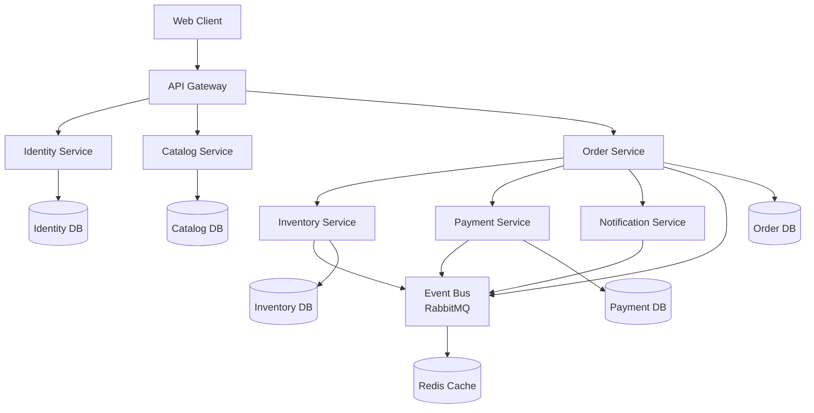

# 🔹 Phase 5: Hands-On Node.js Example

## Overview
This section provides a complete, runnable Node.js implementation demonstrating the transformation from monolith to microservices using DDD principles. You'll see real code, database schemas, API endpoints, and deployment configurations.

---

## 📁 Project Structure

```
05-nodejs-example/
├── README.md                    # This file
├── docker-compose.yml           # Full stack deployment
├── api-gateway/                 # API Gateway service
├── monolith/                    # Original monolithic application
├── microservices/               # Decomposed services
│   ├── identity-service/        # User authentication & management
│   ├── catalog-service/         # Product catalog & search
│   ├── inventory-service/       # Stock management
│   ├── order-service/           # Order processing
│   ├── payment-service/         # Payment processing
│   └── notification-service/    # Email & messaging
├── shared/                      # Shared libraries
│   ├── domain-events/           # Event definitions
│   ├── common-types/            # TypeScript definitions
│   └── event-bus/               # Event infrastructure
└── infrastructure/              # Database migrations, monitoring
    ├── databases/               # Database schemas
    ├── monitoring/              # Prometheus, Grafana
    └── kubernetes/              # K8s deployment files
```

---

## 🎯 Learning Objectives

By working through this example, you'll learn to:

1. **Model a business domain** using DDD tactical patterns
2. **Implement aggregates, repositories, and domain services** in Node.js
3. **Extract bounded contexts** from a monolithic codebase
4. **Implement event-driven communication** between services
5. **Apply the Saga pattern** for distributed transactions
6. **Use CQRS** for read/write separation
7. **Implement the Transactional Outbox** pattern
8. **Deploy microservices** with Docker and Kubernetes

---

## 🚀 Quick Start

### Prerequisites
- Node.js 18+
- Docker & Docker Compose
- PostgreSQL 14+
- Redis 6+

### Run the Complete System
```bash
# Clone and setup
git clone <repository>
cd DDD-Learn-using-ai/05-nodejs-example

# Start all services
docker-compose up -d

# Initialize databases
npm run db:migrate

# Seed test data
npm run db:seed

# Verify system health
curl http://localhost:8080/health
```

### Test the E-commerce Flow
```bash
# 1. Register a customer
curl -X POST http://localhost:8080/api/customers \
  -H "Content-Type: application/json" \
  -d '{"email": "john@example.com", "name": "John Doe"}'

# 2. Browse products
curl http://localhost:8080/api/products

# 3. Create an order
curl -X POST http://localhost:8080/api/orders \
  -H "Content-Type: application/json" \
  -H "Authorization: Bearer <token>" \
  -d '{
    "customerId": "customer-123",
    "items": [
      {"productId": "product-456", "quantity": 2}
    ]
  }'

# 4. Track order status
curl http://localhost:8080/api/orders/order-789/status
```

---

## 📋 Implementation Roadmap

### Phase 1: Monolith Implementation
- [ ] **Domain Model**: Entities, Value Objects, Aggregates
- [ ] **Application Services**: Use case implementations
- [ ] **Infrastructure**: Database, repositories
- [ ] **API Layer**: REST endpoints
- [ ] **Tests**: Unit and integration tests

### Phase 2: Service Extraction
- [ ] **Identity Service**: User authentication and management
- [ ] **Catalog Service**: Product information and search
- [ ] **Inventory Service**: Stock management and reservations
- [ ] **Order Service**: Order processing and tracking

### Phase 3: Event-Driven Architecture
- [ ] **Event Bus**: RabbitMQ/Redis implementation
- [ ] **Domain Events**: Event definitions and handlers
- [ ] **Saga Implementation**: Order processing workflow
- [ ] **Transactional Outbox**: Reliable event publishing

### Phase 4: Advanced Patterns
- [ ] **CQRS**: Read/write model separation
- [ ] **API Gateway**: Single entry point and routing
- [ ] **Monitoring**: Metrics, logging, tracing
- [ ] **Deployment**: Docker, Kubernetes, CI/CD

---

## 🏗️ Architecture Overview

### System Architecture Diagram


### Service Responsibilities

| Service | Bounded Context | Responsibilities |
|---------|----------------|------------------|
| **Identity Service** | User Management | Authentication, user profiles, roles |
| **Catalog Service** | Product Catalog | Product information, categories, search |
| **Inventory Service** | Stock Management | Stock levels, reservations, warehouse |
| **Order Service** | Order Processing | Order lifecycle, validation, tracking |
| **Payment Service** | Financial Transactions | Payment processing, billing |
| **Notification Service** | Communication | Email, SMS, push notifications |

---

## 📚 Key Implementation Highlights

### 1. Rich Domain Model Example
```javascript
// order-service/src/domain/Order.js
class Order {
  constructor(orderId, customerId) {
    this.orderId = orderId;
    this.customerId = customerId;
    this.status = OrderStatus.PENDING;
    this.lineItems = [];
    this.shippingAddress = null;
    this.totalAmount = Money.zero('USD');
    this.domainEvents = [];
  }
  
  static create(customerId, lineItems, shippingAddress) {
    const order = new Order(generateId(), customerId);
    
    lineItems.forEach(item => {
      order.addLineItem(item.productId, item.quantity, item.unitPrice);
    });
    
    order.setShippingAddress(shippingAddress);
    
    order.addDomainEvent(new OrderCreated({
      orderId: order.orderId,
      customerId: order.customerId,
      lineItems: order.lineItems,
      totalAmount: order.totalAmount
    }));
    
    return order;
  }
  
  confirm() {
    if (this.status !== OrderStatus.PENDING) {
      throw new DomainError('Only pending orders can be confirmed');
    }
    
    this.status = OrderStatus.CONFIRMED;
    
    this.addDomainEvent(new OrderConfirmed({
      orderId: this.orderId,
      totalAmount: this.totalAmount
    }));
  }
}
```

### 2. Saga Pattern Implementation
```javascript
// order-service/src/application/OrderSaga.js
class OrderProcessingSaga {
  async execute(createOrderCommand) {
    const sagaId = generateId();
    
    try {
      // Step 1: Reserve inventory
      await this.inventoryService.reserveStock({
        items: createOrderCommand.items,
        sagaId
      });
      
      // Step 2: Process payment
      await this.paymentService.authorizePayment({
        customerId: createOrderCommand.customerId,
        amount: createOrderCommand.totalAmount,
        sagaId
      });
      
      // Step 3: Create order
      const order = await this.orderService.createOrder(createOrderCommand);
      
      return order;
      
    } catch (error) {
      await this.compensate(sagaId);
      throw error;
    }
  }
}
```

### 3. CQRS Implementation
```javascript
// catalog-service/src/application/ProductQueryService.js
class ProductQueryService {
  constructor(readModelRepository) {
    this.readModelRepository = readModelRepository;
  }
  
  async searchProducts(query) {
    return await this.readModelRepository.search({
      text: query.searchText,
      category: query.category,
      priceRange: query.priceRange,
      page: query.page,
      limit: query.limit
    });
  }
  
  async getProductDetails(productId) {
    const product = await this.readModelRepository.findById(productId);
    const reviews = await this.readModelRepository.getProductReviews(productId);
    const recommendations = await this.readModelRepository.getRecommendations(productId);
    
    return {
      product,
      reviews,
      recommendations
    };
  }
}
```

### 4. Event-Driven Communication
```javascript
// shared/event-bus/EventBus.js
class EventBus {
  async publish(event) {
    await this.rabbitMQ.publish('domain-events', {
      eventType: event.constructor.name,
      eventData: event,
      eventId: generateId(),
      timestamp: new Date(),
      version: 1
    });
  }
  
  async subscribe(eventType, handler) {
    await this.rabbitMQ.subscribe(`${eventType}-handlers`, async (message) => {
      try {
        await handler(message.eventData);
        message.ack();
      } catch (error) {
        console.error(`Error handling ${eventType}:`, error);
        message.nack();
      }
    });
  }
}
```

---

## 🧪 Testing Strategy

### Test Types and Coverage

| Test Type | Scope | Tools | Coverage |
|-----------|-------|-------|----------|
| **Unit Tests** | Domain logic | Jest | Entities, Value Objects, Domain Services |
| **Integration Tests** | Service boundaries | Supertest | API endpoints, Database operations |
| **Contract Tests** | Service communication | Pact | Inter-service APIs |
| **End-to-End Tests** | Business scenarios | Playwright | Critical user journeys |
| **Performance Tests** | Scalability | Artillery | Load testing, stress testing |

### Example Test Cases
```javascript
// order-service/tests/domain/Order.test.js
describe('Order Domain Model', () => {
  test('should create order with line items', () => {
    const order = Order.create(
      'customer-123',
      [{ productId: 'product-456', quantity: 2, unitPrice: 29.99 }],
      new Address('123 Main St', 'Anytown', 'AT', '12345')
    );
    
    expect(order.customerId).toBe('customer-123');
    expect(order.lineItems).toHaveLength(1);
    expect(order.totalAmount.amount).toBe(59.98);
    expect(order.status).toBe(OrderStatus.PENDING);
  });
  
  test('should not allow confirming empty order', () => {
    const order = new Order('order-123', 'customer-456');
    
    expect(() => order.confirm()).toThrow('Cannot confirm empty order');
  });
});

// integration test example
describe('Order API', () => {
  test('POST /api/orders should create order', async () => {
    const response = await request(app)
      .post('/api/orders')
      .set('Authorization', `Bearer ${validToken}`)
      .send({
        customerId: 'customer-123',
        items: [
          { productId: 'product-456', quantity: 2 }
        ],
        shippingAddress: {
          street: '123 Main St',
          city: 'Anytown',
          state: 'AT',
          zipCode: '12345'
        }
      });
    
    expect(response.status).toBe(201);
    expect(response.body.orderId).toBeDefined();
    expect(response.body.status).toBe('PENDING');
  });
});
```

---

## 📊 Monitoring and Observability

### Metrics Collection
- **Business Metrics**: Order volume, conversion rates, revenue
- **Technical Metrics**: Request latency, error rates, throughput
- **Infrastructure Metrics**: CPU, memory, database connections

### Logging Strategy
- **Structured Logging**: JSON format with correlation IDs
- **Log Levels**: ERROR, WARN, INFO, DEBUG
- **Centralized Logging**: ELK stack or similar

### Distributed Tracing
- **Request Tracing**: Follow requests across services
- **Performance Analysis**: Identify bottlenecks
- **Error Debugging**: Trace error propagation

---

## 🚀 Deployment and Infrastructure

### Development Environment
```bash
# Start services for development
docker-compose -f docker-compose.dev.yml up -d

# Run specific service locally
cd microservices/order-service
npm run dev

# Run tests
npm test
npm run test:integration
```

### Production Deployment
```yaml
# kubernetes/order-service-deployment.yml
apiVersion: apps/v1
kind: Deployment
metadata:
  name: order-service
spec:
  replicas: 3
  selector:
    matchLabels:
      app: order-service
  template:
    metadata:
      labels:
        app: order-service
    spec:
      containers:
      - name: order-service
        image: order-service:latest
        ports:
        - containerPort: 3000
        env:
        - name: DATABASE_URL
          valueFrom:
            secretKeyRef:
              name: order-service-secrets
              key: database-url
        - name: REDIS_URL
          value: "redis://redis-service:6379"
        resources:
          requests:
            memory: "256Mi"
            cpu: "250m"
          limits:
            memory: "512Mi"
            cpu: "500m"
```

---

## 📝 Next Steps

After completing this hands-on example:

1. **Experiment with the code**: Modify business rules, add new features
2. **Performance testing**: Load test the system and identify bottlenecks
3. **Add new services**: Implement shipping service, recommendation engine
4. **Advanced patterns**: Add event sourcing, implement CQRS fully
5. **Production readiness**: Add comprehensive monitoring, backup strategies

---

## 📁 File Index

| File/Directory | Purpose | Key Concepts |
|----------------|---------|--------------|
| `monolith/` | Original monolithic implementation | Traditional layered architecture |
| `microservices/order-service/` | Order processing service | DDD aggregates, domain events |
| `microservices/inventory-service/` | Stock management | Event handling, reservations |
| `microservices/catalog-service/` | Product catalog | CQRS, read models |
| `api-gateway/` | API gateway implementation | Routing, authentication |
| `shared/event-bus/` | Event infrastructure | Event publishing, subscriptions |
| `infrastructure/` | Deployment and monitoring | Docker, Kubernetes, monitoring |

---

Continue to explore the detailed implementation in each subdirectory to see DDD principles applied in practice!