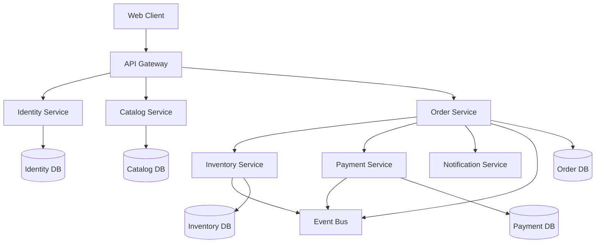

# 🏗️ Domain-Driven Design: Complete Learning & Implementation Guide

> **Master DDD principles and confidently decompose monolithic systems into microservices using real-world Node.js examples**

[](https://opensource.org/licenses/MIT)
[](https://nodejs.org/)
[](https://domainlanguage.com/)
[](https://microservices.io/)
[](https://www.docker.com/)
[](https://kubernetes.io/)

---

## 📖 Table of Contents

- [What You'll Learn](#-what-youll-learn)
- [Learning Path](#-learning-path)
- [Detailed Learning Phases](#-detailed-learning-phases)
- [Quick Start](#-quick-start)
- [Progress Tracker](#-progress-tracker)
- [Success Metrics](#-success-metrics)
- [Architecture Overview](#️-architecture-overview)
- [Prerequisites](#-prerequisites)
- [Technology Stack](#️-technology-stack)
- [Project Structure](#-project-structure)
- [Getting Help](#-getting-help)
- [Support & Community](#-support--community)
- [Contributing](#-contributing)
- [License](#-license)

## 🎯 What You'll Learn

This comprehensive guide transforms you from DDD beginner to microservices expert through practical, hands-on learning:

### 🎓 Core Knowledge
- **Strategic DDD**: Bounded contexts, context mapping, ubiquitous language
- **Tactical DDD**: Entities, value objects, aggregates, repositories, domain services
- **Domain Modeling**: Transform complex business requirements into clean code
- **Event-Driven Architecture**: Domain events, event sourcing, CQRS patterns

### 🏗️ Practical Skills
- **Monolith Decomposition**: Extract microservices using DDD principles
- **Microservice Patterns**: Saga, Anti-Corruption Layer, Transactional Outbox
- **Production Deployment**: Docker, Kubernetes, monitoring, observability
- **Performance Optimization**: Caching, database optimization, load testing

### 💼 Business Value
- **Technical Leadership**: Make informed architectural decisions
- **Team Collaboration**: Bridge business and technical stakeholders
- **Problem Solving**: Model complex domains with confidence
- **Interview Readiness**: Excel in system design interviews

---

## 📚 Learning Path

| Phase | Topic | Outcome | Time |
|-------|-------|---------|------|
| **Phase 1** | [DDD Core Concepts](./domain-driven-design-learn-using-ai/01-DDD-Core-Concepts.md) | Master strategic & tactical DDD building blocks | 1-2 days |
| **Phase 2** | [Problem-to-Solution Mapping](./domain-driven-design-learn-using-ai/02-Problem-to-Solution-Mapping.md) | Model real business problems using DDD | 1-2 days |
| **Phase 3** | [Monolith Decomposition](./domain-driven-design-learn-using-ai/03-Monolith-Decomposition.md) | Split monoliths into bounded contexts | 2-3 days |
| **Phase 4** | [Microservice Patterns](./domain-driven-design-learn-using-ai/04-Microservice-Patterns.md) | Implement Saga, CQRS, Event Sourcing | 3-4 days |
| **Phase 5** | [Node.js Implementation](./domain-driven-design-learn-using-ai/05-nodejs-example/) | Build complete microservices system | 5-7 days |
| **Phase 6** | [FAQ & Interview Guide](./domain-driven-design-learn-using-ai/06-FAQ-Interview-Guide.md) | Master common questions & edge cases | 1-2 days |
| **Phase 7** | [3-Week Learning Plan](./domain-driven-design-learn-using-ai/07-Learning-Plan.md) | Structured daily progression | 21 days |

---

## 🎓 Detailed Learning Phases

### Phase 1: Foundation
| Document | Focus | Time | Skills Gained |
|----------|-------|------|---------------|
| [`01-DDD-Core-Concepts.md`](./domain-driven-design-learn-using-ai/01-DDD-Core-Concepts.md) | Strategic & Tactical DDD patterns | 1-2 days | Ubiquitous language, bounded contexts, entities, aggregates |

### Phase 2: Modeling
| Document | Focus | Time | Skills Gained |
|----------|-------|------|---------------|
| [`02-Problem-to-Solution-Mapping.md`](./domain-driven-design-learn-using-ai/02-Problem-to-Solution-Mapping.md) | Transform business problems into DDD models | 1-2 days | Domain modeling, context identification |

### Phase 3: Architecture
| Document | Focus | Time | Skills Gained |
|----------|-------|------|---------------|
| [`03-Monolith-Decomposition.md`](./domain-driven-design-learn-using-ai/03-Monolith-Decomposition.md) | Break monoliths into bounded contexts | 2-3 days | Service boundaries, data decomposition |

### Phase 4: Patterns
| Document | Focus | Time | Skills Gained |
|----------|-------|------|---------------|
| [`04-Microservice-Patterns.md`](./domain-driven-design-learn-using-ai/04-Microservice-Patterns.md) | Advanced microservice patterns | 3-4 days | Saga, CQRS, Event Sourcing, Anti-Corruption Layer |

### Phase 5: Implementation
| Folder | Focus | Time | Skills Gained |
|--------|-------|------|---------------|
| [`05-nodejs-example/`](./domain-driven-design-learn-using-ai/05-nodejs-example/) | Complete working Node.js example | 5-7 days | Practical DDD implementation, Docker, microservices |

### Phase 6: Mastery
| Document | Focus | Time | Skills Gained |
|----------|-------|------|---------------|
| [`06-FAQ-Interview-Guide.md`](./domain-driven-design-learn-using-ai/06-FAQ-Interview-Guide.md) | Common questions and edge cases | 1-2 days | Interview preparation, troubleshooting |

### Phase 7: Planning
| Document | Focus | Time | Skills Gained |
|----------|-------|------|---------------|
| [`07-Learning-Plan.md`](./domain-driven-design-learn-using-ai/07-Learning-Plan.md) | 3-week structured learning schedule | 21 days | Systematic progression, daily objectives |

### 🛠️ Practical Implementation Structure
```
05-nodejs-example/
├── README.md                    # Setup and running instructions
├── docker-compose.yml           # Multi-service orchestration
├── docker/                      # Docker configurations
└── microservices/
    └── order-service/
        └── src/
            ├── application/      # Application services (use cases)
            │   └── OrderApplicationService.js
            └── domain/          # Domain models and logic
                └── Order.js
```

## 🚀 Quick Start

### Option 1: Structured Learning (Recommended for beginners)
Follow the structured learning plan:
```bash
git clone <repository-url>
cd domain-driven-design
```

Start with: [3-Week Learning Plan](./domain-driven-design-learn-using-ai/07-Learning-Plan.md)
- Follow phases 1-6 in sequence
- Dedicate 3-4 hours per day for 3 weeks
- Complete exercises and track progress

### Option 2: Hands-On First (For experienced developers)
Jump straight into the working example:
```bash
cd domain-driven-design-learn-using-ai/05-nodejs-example
docker-compose up -d
```
- Run the complete system immediately
- Reverse-engineer concepts from working code
- Build understanding through practical exploration

### Option 3: Theory Deep-Dive (For architects)
Begin with theoretical foundations:
- Start with [DDD Core Concepts](./domain-driven-design-learn-using-ai/01-DDD-Core-Concepts.md)
- Study [Problem-to-Solution Mapping](./domain-driven-design-learn-using-ai/02-Problem-to-Solution-Mapping.md)
- Focus on strategic design patterns first

---

## 📊 Progress Tracker

Track your learning journey through the phases:

- [ ] **Phase 1 Complete**: Understanding of DDD vocabulary and basic patterns
- [ ] **Phase 2 Complete**: Can model business problems using DDD
- [ ] **Phase 3 Complete**: Can decompose monoliths into services
- [ ] **Phase 4 Complete**: Master advanced microservice patterns
- [ ] **Phase 5 Complete**: Built and deployed complete DDD system
- [ ] **Phase 6 Complete**: Ready for production challenges
- [ ] **Phase 7 Complete**: Can teach others and lead DDD initiatives

---

## 🎯 Success Metrics

By completion, you should be able to:

### Strategic Design
- ✅ Identify bounded contexts in any business domain
- ✅ Create context maps showing service relationships
- ✅ Design ubiquitous language with stakeholders
- ✅ Distinguish core vs supporting subdomains

### Tactical Implementation
- ✅ Build rich domain models with proper boundaries
- ✅ Implement aggregates with consistency guarantees
- ✅ Design repositories and domain services
- ✅ Handle domain events for decoupling

### Microservice Architecture
- ✅ Decompose monoliths using DDD principles
- ✅ Implement saga patterns for distributed transactions
- ✅ Apply CQRS for read/write separation
- ✅ Build event-driven systems with reliability

### Production Skills
- ✅ Deploy with Docker and Kubernetes
- ✅ Implement monitoring and observability
- ✅ Handle failures with circuit breakers
- ✅ Optimize for performance and scale

## 🏗️ Architecture Overview

The example implementation demonstrates a complete e-commerce platform:



## 💼 Real-World Applications

This knowledge applies directly to:

- **Enterprise Software**: Large-scale business applications
- **E-commerce Platforms**: Order processing, inventory, payments
- **Financial Systems**: Complex business rules and regulations
- **Healthcare**: Patient management, medical records
- **Logistics**: Supply chain, warehouse management

## 📖 Prerequisites

- **Programming**: Intermediate JavaScript/Node.js knowledge
- **Architecture**: Basic understanding of web services
- **Tools**: Familiarity with Git, command line
- **Time**: 45-60 hours total (3-4 hours/day for 3 weeks)

## 🛠️ Technology Stack

### Core Technologies
- **Node.js 18+** - Runtime environment
- **Express.js** - Web framework
- **PostgreSQL** - Database per service
- **Redis** - Caching and sessions
- **RabbitMQ** - Event messaging

### DevOps & Monitoring
- **Docker** - Containerization
- **Kubernetes** - Orchestration
- **Prometheus** - Metrics collection
- **Grafana** - Monitoring dashboards
- **Jaeger** - Distributed tracing

## 📊 Project Structure

```
domain-driven-design/
├── README.md                                    # Complete learning guide & navigation
├── domain-driven-design-learn-using-ai/
│   ├── 01-DDD-Core-Concepts.md                # Strategic & tactical patterns
│   ├── 02-Problem-to-Solution-Mapping.md      # Domain modeling process
│   ├── 03-Monolith-Decomposition.md           # Service extraction strategies
│   ├── 04-Microservice-Patterns.md            # Advanced patterns (Saga, CQRS)
│   ├── 05-nodejs-example/                     # Complete working implementation
│   ├── 06-FAQ-Interview-Guide.md              # Common questions & answers
│   ├── 07-Learning-Plan.md                    # 3-week structured plan
│   └── Requirements.md                        # Original project requirements
```

---

## � Getting Help

### Common Learning Challenges

1. **Overwhelmed by concepts**: Start with [3-Week Learning Plan](./domain-driven-design-learn-using-ai/07-Learning-Plan.md) for structured approach
2. **Can't identify bounded contexts**: Focus on [Problem-to-Solution Mapping](./domain-driven-design-learn-using-ai/02-Problem-to-Solution-Mapping.md) exercises
3. **Technical implementation challenges**: Deep dive into [Node.js Example](./domain-driven-design-learn-using-ai/05-nodejs-example/)
4. **Interview preparation**: Use [FAQ & Interview Guide](./domain-driven-design-learn-using-ai/06-FAQ-Interview-Guide.md) for targeted practice

### Support Resources
- Each document includes practical exercises and examples
- Node.js implementation provides working reference code
- FAQ section addresses common misconceptions
- Learning plan provides daily guidance and milestones

### Troubleshooting
- **Build Issues**: Check Docker and Node.js versions
- **Concept Confusion**: Review glossary in core concepts
- **Pattern Application**: Study real-world examples in each phase
- **Time Management**: Follow suggested time allocations per phase

## 🤝 Contributing

We welcome contributions! Please see our contributing guidelines:

1. **Documentation**: Improve explanations, add examples
2. **Code Examples**: Enhance implementation patterns
3. **Bug Fixes**: Correct errors in code or documentation
4. **New Patterns**: Add relevant DDD/microservice patterns

## 📞 Support & Community

- **GitHub Issues**: Technical questions and bug reports
- **Discussions**: Architecture and design conversations
- **LinkedIn**: Connect for professional networking
- **Blog Posts**: Share your learning journey

## 📜 License

This project is licensed under the MIT License - see the [LICENSE](LICENSE) file for details.

## 🌟 Acknowledgments

- **Eric Evans** - For pioneering Domain-Driven Design
- **Vaughn Vernon** - For practical DDD implementation guidance
- **Martin Fowler** - For microservices architectural patterns
- **The DDD Community** - For continuous learning and sharing

---

**Ready to master Domain-Driven Design?** Start your journey now! 🚀

> *"The heart of software is its ability to solve domain-related problems for its user."* - Eric Evans
