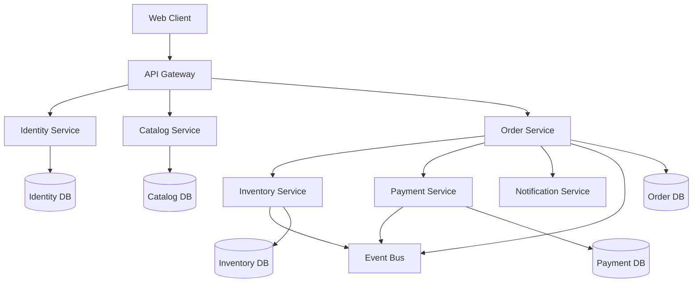

# 🏗️ Domain-Driven Design: Complete Learning & Implementation Guide

> **Master DDD principles and confidently decompose monolithic systems into microservices using real-world Node.js examples**

[](https://opensource.org/licenses/MIT)
[](https://nodejs.org/)
[](https://domainlanguage.com/)
[](https://microservices.io/)
[](https://www.docker.com/)
[](https://kubernetes.io/)

---

## 📖 Table of Contents

- [What You'll Learn](#-what-youll-learn)
- [Learning Path](#-learning-path)
- [Quick Start](#-quick-start)
- [Architecture Overview](#️-architecture-overview)
- [Prerequisites](#-prerequisites)
- [Technology Stack](#️-technology-stack)
- [Project Structure](#-project-structure)
- [Key Features](#-key-features)
- [Learning Outcomes](#-learning-outcomes)
- [Success Metrics](#-success-metrics)
- [Support & Community](#-support--community)
- [Contributing](#-contributing)
- [License](#-license)

## 🎯 What You'll Learn

This comprehensive guide transforms you from DDD beginner to microservices expert through practical, hands-on learning:

### 🎓 Core Knowledge
- **Strategic DDD**: Bounded contexts, context mapping, ubiquitous language
- **Tactical DDD**: Entities, value objects, aggregates, repositories, domain services
- **Domain Modeling**: Transform complex business requirements into clean code
- **Event-Driven Architecture**: Domain events, event sourcing, CQRS patterns

### 🏗️ Practical Skills
- **Monolith Decomposition**: Extract microservices using DDD principles
- **Microservice Patterns**: Saga, Anti-Corruption Layer, Transactional Outbox
- **Production Deployment**: Docker, Kubernetes, monitoring, observability
- **Performance Optimization**: Caching, database optimization, load testing

### 💼 Business Value
- **Technical Leadership**: Make informed architectural decisions
- **Team Collaboration**: Bridge business and technical stakeholders
- **Problem Solving**: Model complex domains with confidence
- **Interview Readiness**: Excel in system design interviews

---

## 📚 Learning Path

| Phase | Topic | Outcome | Time |
|-------|-------|---------|------|
| **Phase 1** | [DDD Core Concepts](./DDD-Learn-using-ai/01-DDD-Core-Concepts.md) | Master strategic & tactical DDD building blocks | 1-2 days |
| **Phase 2** | [Problem-to-Solution Mapping](./DDD-Learn-using-ai/02-Problem-to-Solution-Mapping.md) | Model real business problems using DDD | 1-2 days |
| **Phase 3** | [Monolith Decomposition](./DDD-Learn-using-ai/03-Monolith-Decomposition.md) | Split monoliths into bounded contexts | 2-3 days |
| **Phase 4** | [Microservice Patterns](./DDD-Learn-using-ai/04-Microservice-Patterns.md) | Implement Saga, CQRS, Event Sourcing | 3-4 days |
| **Phase 5** | [Node.js Implementation](./DDD-Learn-using-ai/05-nodejs-example/) | Build complete microservices system | 5-7 days |
| **Phase 6** | [FAQ & Interview Guide](./DDD-Learn-using-ai/06-FAQ-Interview-Guide.md) | Master common questions & edge cases | 1-2 days |
| **Phase 7** | [3-Week Learning Plan](./DDD-Learn-using-ai/07-Learning-Plan.md) | Structured daily progression | 21 days |

## 🚀 Quick Start

### Option 1: Guided Learning (Recommended)
Follow the structured learning plan:
```bash
git clone <repository-url>
cd domain-driven-design
```

Start with: [3-Week Learning Plan](./DDD-Learn-using-ai/07-Learning-Plan.md)

### Option 2: Hands-On First
Jump straight into the working example:
```bash
cd DDD-Learn-using-ai/05-nodejs-example
docker-compose up -d
```

### Option 3: Concept Deep-Dive
Begin with theoretical foundations:
- [DDD Core Concepts](./DDD-Learn-using-ai/01-DDD-Core-Concepts.md)

## 🏗️ Architecture Overview

The example implementation demonstrates a complete e-commerce platform:



## 🎓 Key Learning Outcomes

### Strategic Design Mastery
- ✅ Identify bounded contexts in complex business domains
- ✅ Create context maps showing service relationships  
- ✅ Distinguish core, supporting, and generic subdomains
- ✅ Design ubiquitous language with business stakeholders

### Tactical Implementation
- ✅ Build rich domain models with entities and value objects
- ✅ Design aggregates with proper consistency boundaries
- ✅ Implement repositories and domain services
- ✅ Handle domain events for loose coupling

### Microservice Expertise  
- ✅ Decompose monoliths using DDD principles
- ✅ Implement saga patterns for distributed transactions
- ✅ Apply CQRS for read/write separation
- ✅ Build event-driven architectures with reliability

### Production Skills
- ✅ Deploy with Docker and Kubernetes
- ✅ Implement monitoring, logging, and tracing
- ✅ Handle failures with circuit breakers and retries
- ✅ Optimize for performance and scalability

## 💼 Real-World Applications

This knowledge applies directly to:

- **Enterprise Software**: Large-scale business applications
- **E-commerce Platforms**: Order processing, inventory, payments
- **Financial Systems**: Complex business rules and regulations
- **Healthcare**: Patient management, medical records
- **Logistics**: Supply chain, warehouse management

## 📖 Prerequisites

- **Programming**: Intermediate JavaScript/Node.js knowledge
- **Architecture**: Basic understanding of web services
- **Tools**: Familiarity with Git, command line
- **Time**: 45-60 hours total (3-4 hours/day for 3 weeks)

## 🛠️ Technology Stack

### Core Technologies
- **Node.js 18+** - Runtime environment
- **Express.js** - Web framework
- **PostgreSQL** - Database per service
- **Redis** - Caching and sessions
- **RabbitMQ** - Event messaging

### DevOps & Monitoring
- **Docker** - Containerization
- **Kubernetes** - Orchestration
- **Prometheus** - Metrics collection
- **Grafana** - Monitoring dashboards
- **Jaeger** - Distributed tracing

## 📊 Project Structure

```
domain-driven-design/
├── README.md                          # This file
├── DDD-Learn-using-ai/
│   ├── 01-DDD-Core-Concepts.md       # Strategic & tactical patterns
│   ├── 02-Problem-to-Solution-Mapping.md  # Domain modeling process
│   ├── 03-Monolith-Decomposition.md  # Service extraction strategies
│   ├── 04-Microservice-Patterns.md   # Advanced patterns (Saga, CQRS)
│   ├── 05-nodejs-example/            # Complete working implementation
│   ├── 06-FAQ-Interview-Guide.md     # Common questions & answers
│   └── 07-Learning-Plan.md           # 3-week structured plan
└── Resources/                         # Additional materials
```

## 🎯 Success Metrics

After completing this guide, you should be able to:

### Technical Skills
- [ ] Design microservices aligned with business domains
- [ ] Implement complex business logic in domain models
- [ ] Handle distributed transactions without two-phase commit
- [ ] Build event-driven systems with proper error handling
- [ ] Deploy production-ready microservices

### Business Skills  
- [ ] Collaborate effectively with domain experts
- [ ] Model complex business requirements accurately
- [ ] Make informed architecture decisions
- [ ] Communicate technical concepts to business stakeholders

### Interview Readiness
- [ ] Explain DDD concepts clearly and concisely
- [ ] Design systems during technical interviews
- [ ] Discuss trade-offs between patterns
- [ ] Handle system design questions confidently

## 🤝 Contributing

We welcome contributions! Please see our contributing guidelines:

1. **Documentation**: Improve explanations, add examples
2. **Code Examples**: Enhance implementation patterns
3. **Bug Fixes**: Correct errors in code or documentation
4. **New Patterns**: Add relevant DDD/microservice patterns

## 📞 Support & Community

- **GitHub Issues**: Technical questions and bug reports
- **Discussions**: Architecture and design conversations
- **LinkedIn**: Connect for professional networking
- **Blog Posts**: Share your learning journey

## 📜 License

This project is licensed under the MIT License - see the [LICENSE](LICENSE) file for details.

## 🌟 Acknowledgments

- **Eric Evans** - For pioneering Domain-Driven Design
- **Vaughn Vernon** - For practical DDD implementation guidance
- **Martin Fowler** - For microservices architectural patterns
- **The DDD Community** - For continuous learning and sharing

---

## 🎓 Learning Path Recommendation

### For Beginners
1. Start with [3-Week Learning Plan](./DDD-Learn-using-ai/07-Learning-Plan.md)
2. Follow daily exercises progressively
3. Build the complete Node.js example
4. Review FAQ for edge cases

### For Experienced Developers
1. Review [DDD Core Concepts](./DDD-Learn-using-ai/01-DDD-Core-Concepts.md) quickly
2. Focus on [Microservice Patterns](./DDD-Learn-using-ai/04-Microservice-Patterns.md)
3. Study the [Node.js Implementation](./DDD-Learn-using-ai/05-nodejs-example/)
4. Use [FAQ](./DDD-Learn-using-ai/06-FAQ-Interview-Guide.md) for interview prep

### For Architects
1. Study [Problem-to-Solution Mapping](./DDD-Learn-using-ai/02-Problem-to-Solution-Mapping.md)
2. Master [Monolith Decomposition](./DDD-Learn-using-ai/03-Monolith-Decomposition.md)
3. Apply patterns to your specific domain
4. Mentor others using this guide

---

**Ready to master Domain-Driven Design?** Start your journey now! 🚀

> *"The heart of software is its ability to solve domain-related problems for its user."* - Eric Evans
